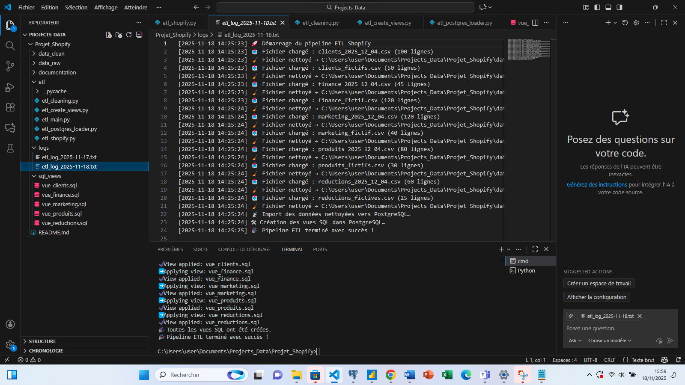
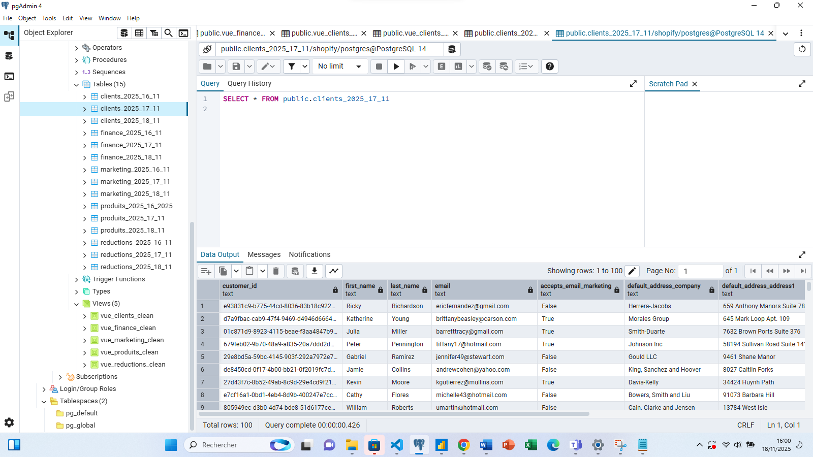
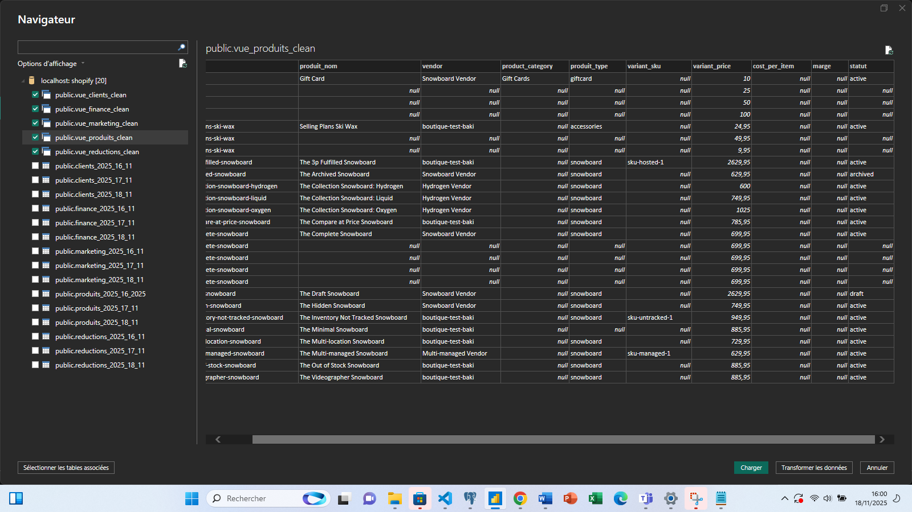
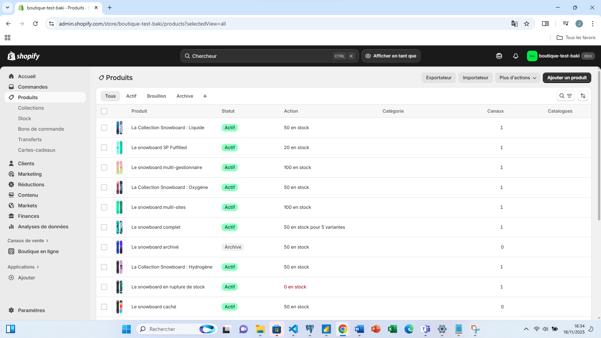

# shopify-etl-pipeline
Pipeline ETL automatisé (Python + PostgreSQL + Power BI) basé sur des données fictives Shopify. Nettoyage, chargement, création de vues SQL et connexion BI .

# Résultats du pipeline

# 1. Log d’exécution

# 2. Tables créées dans PostgreSQL

# 3. Connexion réussie dans Power BI

# 4. Données Shopify utilisées

